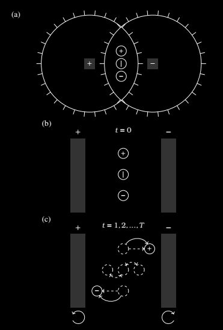
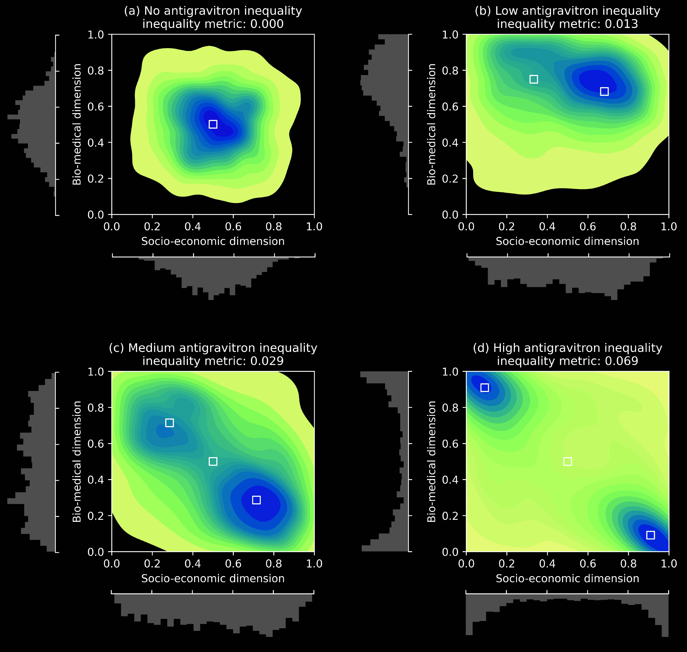

# AntiGravitron
AntiGravitron polarizing inequality

* A novel framework for measuring multidimensional inequality based on a statistical physics reinterpretation of centrifugal and centripetal forces in rotating systems. 
* Inspired by the mechanics of the Gravitron and extended via the conceptual AntiGravitron (a thought experiment that models the polarization dynamics of social inclusion and exclusion). 
* A new class of inequality metrics grounded in multivariate mixtures of Beta distributions. 
* The composite metrics capture three key structural dimensions of polarizing inequality: the number and balance of population clusters (modal entropy), the internal uniformity of each cluster (concentration), and the separation between clusters in attribute space (geometric divergence).

Building on analogies from magnetohydrodynamics, non-equilibrium statistical mechanics, and entropy-based modeling, the AntiGravitron conceptualizes inequality not as a scalar deviation from equality, but as an emergent property of multimodal distributional geometry in bounded domains. Monte Carlo simulations of the AntiGravitron show how bifurcation, stratification, and polarization jointly influence inequality measurements due to multidimensional attraction-repulsion forces. An empirical application of the AntiGravitron to US household income data reveals polarized inequality driven by intersecting centripetal and centrifugal socio-economic forces affecting Black and African American populations in the Philadelphia County. By bridging physical systems theory and social stratification analysis, this paper offers a rigorous, flexible, and interpretable metric that enhances the understanding of polarizing inequality in high-dimensional, structurally heterogeneous contexts. The AntiGravitron framework holds promise for small-area estimation of polarization-driven inequality in socio-economics and biomedicine domains such as epidemiology, where inequality arises from multi-axial exclusion and attractor dynamics.

  

AntiGravitron dynamics with two counter-rotating rotors and three interacting particles. (a) Planar (top-down) schematic of the AntiGravitron device, composed of two overlapping circular rotors, each containing a central dynamo spindle generating magnetic fields of opposite polarity. The left spindle is positively charged, while the right spindle is negatively charged. Three particles: positive (+), neutral (|), and negative (-) are symmetrically initialized within the overlapping region of the rotors. (b) Elevation view of the system at rest (t = 0), representing the initial state of reflectional symmetry and spatial equilibrium, where no net force induces charge-dependent displacement. (c) As the rotors initiate rotation at time t = 1, 2,..., T, dynamical asymmetry emerges due to the interaction between centrifugal forces and Lorentz magnetic forces. The positively charged particle migrates toward the negatively charged spindle (right), which rotates clockwise, while the negatively charged particle is attracted to the positively charged spindle (left), which rotates counterclockwise. Neutrally charged particles undergo inertial oscillations. Dashed circles illustrate intermediate positions and the solid curves indicate the non-linear trajectories caused by the Coriolis effect. This transition from symmetric to asymmetric charge distributions models a bifurcation process analogous to the emergence of inequality under competing attractors.

  

Monte Carlo simulation: Joint density plots and marginal histograms for four simulated scenarios of AntiGravitron inequality. Each subplot depicts increasing levels of multimodality and density stratification across socio-economic and bio-medical dimensions. Black squares represent mode centers. The inequality metric increases with the number of modes, the sharpness of local concentration, and the spatial distance between modal centers, illustrating how probabilistic inequality can be geometrically quantified in a bounded multivariate framework inspired by (anti)gravitron forces from statistical physics.
